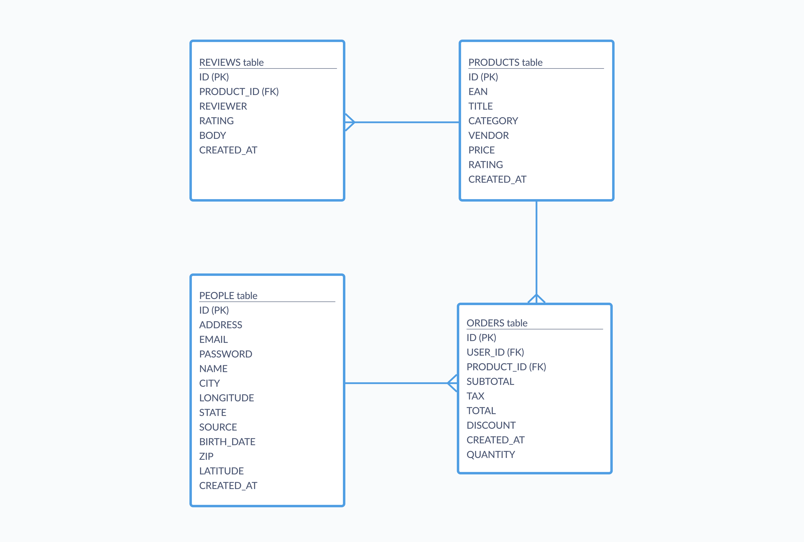

# Database and SQL Script

This repository contains the SQL script to create a database and tables based on a provided ERD diagram, along with sample statements to populate the tables with data.

## Files

- `database_script.sql` - SQL script that creates the database, tables, and sample data

## Database Schema

The database schema consists of the following tables:

- Reviews
- Products 
- Orders
- People

## Sample Data 

Each table has 5 rows inserted as sample data for testing purposes.
